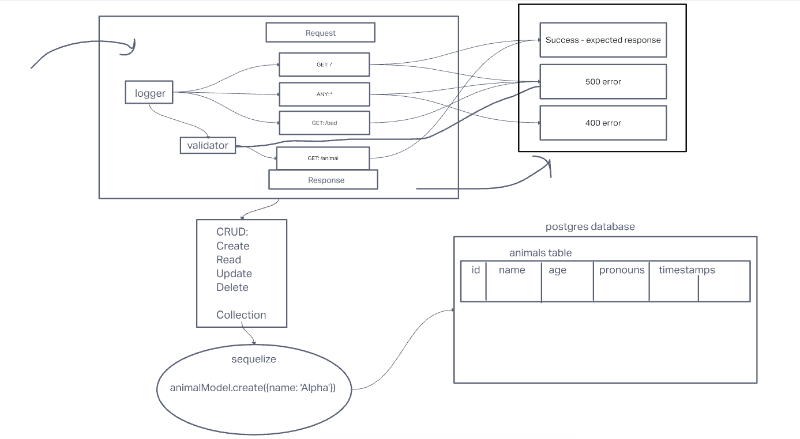

# LAB - Class 4

## Project: API Server

### Author: Yen Xiong Yuan

### Problem Domain

#### Routes

In your express server, create a route module for each data model that you’ve created. Within the router module, create REST route handlers for each of the REST Methods that properly calls the correct CRUD method from the matching data model.

#### Add a Record

CRUD Operation: Create
REST Method: POST
Path: /animal
Input: JSON Object in the Request Body
Returns: The record that was added to the database.
You must generate an ID and attach it to the object.
You should verify that only the fields you define get saved as a record.

#### Get All Records

CRUD Operation: Read
REST Method: GET
Path: /animal
Returns: An array of objects, each object being one entry from your database.

#### Get One Record

CRUD Operation: Read
REST Method: GET
Path: /animal/1
Returns: The object from the database, which has the id matching that which is in the path.

#### Update a Record
CRUD Operation: Update
REST Method: PUT
Path: /animal/1
Input: JSON Object in the Request Body
Returns: The object from the database, which has the id matching that which is in the path, with the 

#### updated/changed data.

You should verify that only the fields you define get saved as a record.

#### Delete a Record
CRUD Operation: Destroy
REST Method: DELETE
Path: /animal/1
Returns: The record from the database as it exists after you delete it (i.e. null).

### Links and Resources

- [GitHub Actions ci/cd](https://github.com/yenxiongyuan/api-server/actions)

### Setup

#### `.env` requirements (where applicable)

for now I have none and do not require one

#### How to initialize/run your application (where applicable)

- e.g. `npm start`

#### How to use your library (where applicable)

#### Features / Routes

- Feature One: Details of feature
- GET : `/hello` - specific route to hit

#### Tests

- How do you run tests?
- Any tests of note?
- Describe any tests that you did not complete, skipped, etc

#### UML

